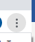
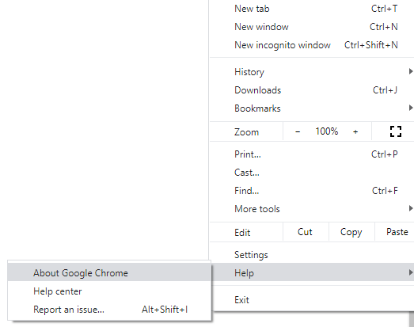
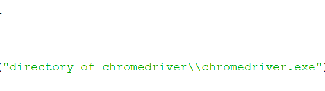
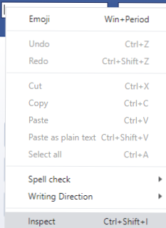
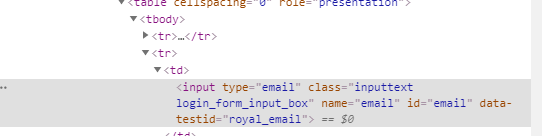
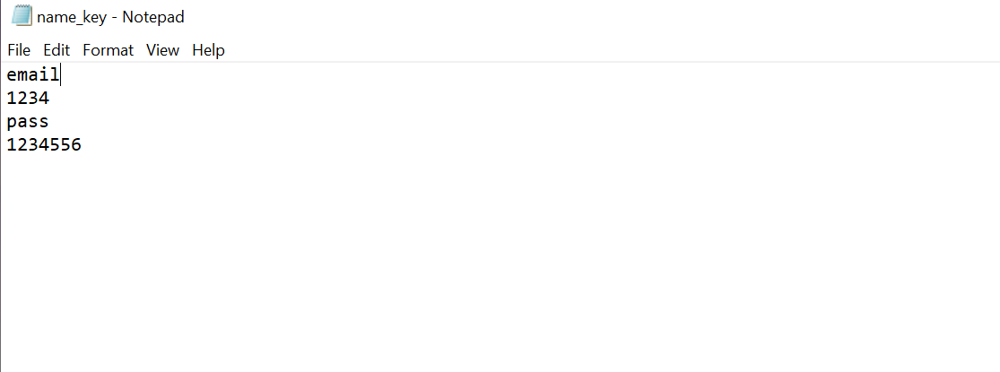

# python-selenium
This is a simple web scrapping program using selenium in python 3.8 for window 10 and using chrome 

** If you are using Firefox,Internet Explorer or Safari please refer at the end of the ReadMe.md which is the whole documentation of selenium python

For this to work you will need to install
* python 3 of any version

Please ensure you use python 3 not python 2 . If you haven't donwload python 3 here is a link

Link: https://www.python.org/

* chromedriver

How to check chrome version

  1 - on the top left corner of the of chrome click the 3 dots menu
  
  
  
  2 - go to Help and About Google Chrome
  
  
  
  3 - you can download your version using https://chromedriver.chromium.org/downloads

* selenium

You can just pip install selenium in your cmd

* tkinter

You can just pip install tkinter in your cmd

For most of the problem you can just copy the error and search it in stack overflow or google

-------------------------------------------------------------------------------------------------

Step By Step On Code Guide

1) Downlod the zip and unzip it on the left top corner in Github

2) Changing the chromedriver directory to your chrome driver directory

You can check your chromedriver directory by right clicking your chromedriver.exe and click properties and copy the directory

** important note

Selenium use \ \ instead of / , ensure all / is changed to \ \ for this program to fully function

3) Go to your desire website and inspect the html by right clicking, in this case I use facebook

4) In this program ,name is used so just copy the name

5) A key is needed to input so in the name_key text a key is inputted

6) Copy the link and run the .py program a window should appear and you will be able to input the link

If you face any problem , you can try copy and paste the error in google or stack overflow
-------------------------

You can do more with selenium this is just a simple autofill program 

If you want to learn more the keyword for this function is called Web Scrapping

For more info regarding selenium

https://selenium-python.readthedocs.io/
